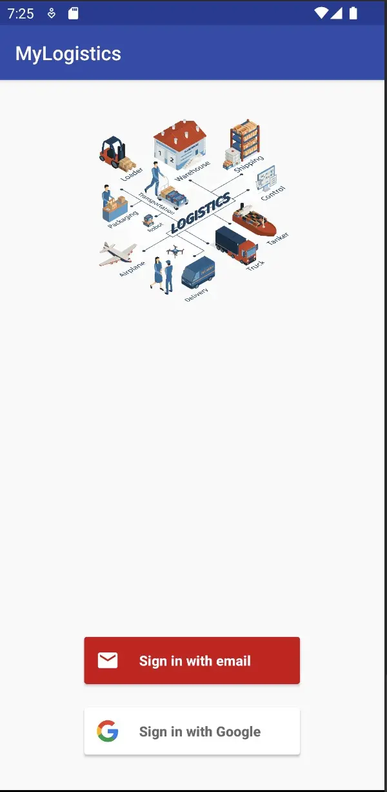
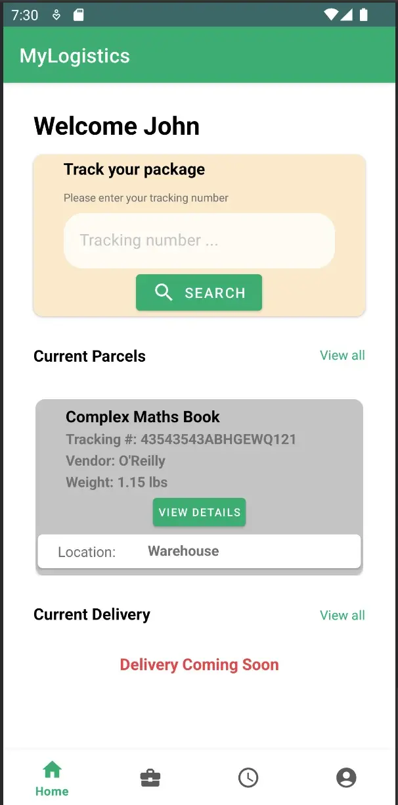
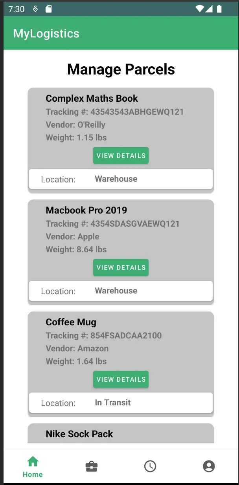
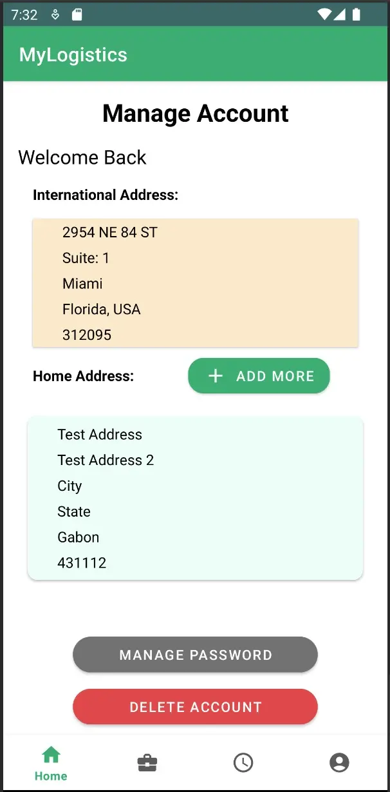
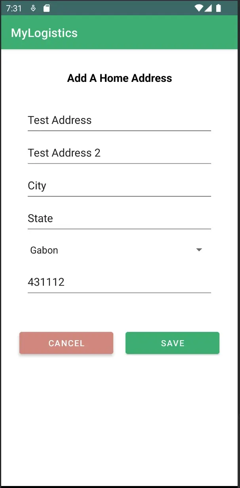

# MyLogistics - Kotlin Mobile Application

-- The goal of this project was to create a mobile app that customers of MyLogistics can leverage to view their imported parcels to be delivered.

-- Parcels status would be managed by a Node web application that will act as the backend for this mobile app or the store manager.

## Features
-- In this mobile application, a user can register sign in, and add their home addresses.
-- Users can view their parcels and parcel details.
-- Users can view their international shipping address if forgotten.

## Challenges with this project
-- Challenge: Project scope was the huge for short time.
> Soltuion for this was to shorten some of the features like the ability to create delivery dates for a parcel to their home addresses. Also the ability to upload invoices for their packages.

-- Challenge: for this was after remove those features i had less options for the user to create object to be added to the database. 

-- Challenge: Building the navigation and allowing the focus to change

### Technology
> Firebase (NoSQL), Kotlin, XML, OAuth(Google)

### Author
> Akeem Palmer - [Github](https://github.com/DevOps242), [LinkedIn](https://www.linkedin.com/in/akeempalmer/), [Portfolio](https://akeempalmer.onrender.com)

### Changes for Assignment 3
> Upgraded the launcher and app icon.
> Fixed the Bottom Navigation to show the active page.
> Secured Firebase-Firestore Database.
> Added AAB to google play internal release (awaiting verification from Google Play Team, currently requested assistance from support's supervisor (case #below/).

Google Pay ⋅ Identity verification
Case ID 9-8189000034335
In progress
Last updated 4 hr ago

Play Console ⋅ Play Console App
Case ID 8-1801000034107
In progress
Last updated 7 days ago

### Images

